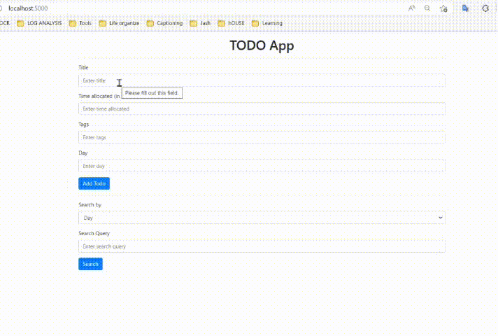

# Our TODO app

_Using MongoDB and Elastic Search_

**Demo:**
<br>


**Steps:**

- ```bash
  git clone https://github.com/AadityaSubedi/bigdata.git
  ```
- ```bash
  pip install -r requirements.txt
  ```
- Change the username and password of Elastic Search
- ```bash
  python app.py
  ```
- Go to [Our webapp here](localhost:5000)

Contributed by:

- 075BCT001(Aaditya Subedi)
- 075BCT014(Arpan Gyawali)
- 075BCT018(Bidhan Khatiwada)
- 075BCT020(Bijay Shrestha)
